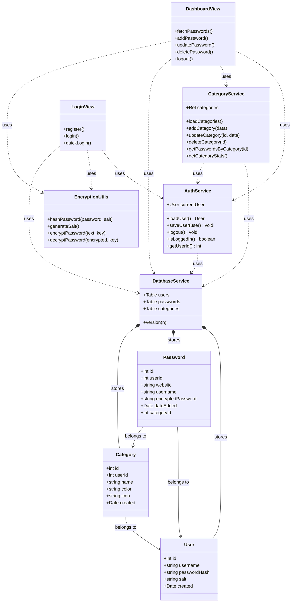

# Password Vault Diagrams

## UML Class Diagram



## Use Case Diagram

```mermaid
usecaseDiagram
    actor "User" as U

    package "Authentication" {
        usecase "Register" as UC1
        usecase "Login" as UC2
        usecase "Logout" as UC3
        usecase "Quick Login (Test User)" as UC4
    }

    package "Password Management" {
        usecase "Add Password" as UC5
        usecase "View Password List" as UC6
        usecase "Edit Password" as UC7
        usecase "Delete Password" as UC8
        usecase "View Decrypted Password" as UC9
        usecase "Filter by Category" as UC10
        usecase "Generate Password" as UC11
        usecase "Import/Export Passwords" as UC12
        usecase "Auto-Capture Password" as UC13
    }

    package "Category Management" {
        usecase "Manage Categories" as UC14
        usecase "Add Category" as UC15
        usecase "Edit Category" as UC16
        usecase "Delete Category" as UC17
    }

    U --> UC1
    U --> UC2
    U --> UC3
    U --> UC4
    
    U --> UC5
    U --> UC6
    U --> UC7
    U --> UC8
    U --> UC9
    U --> UC10
    U --> UC11
    U --> UC12
    U --> UC13

    U --> UC14
    UC14 ..> UC15 : include
    UC14 ..> UC16 : include
    UC14 ..> UC17 : include

    UC2 ..> UC5 : precondition
    UC2 ..> UC6 : precondition
```
